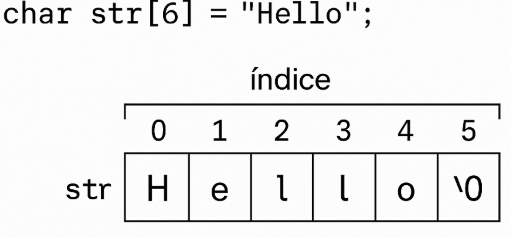

# Cadena de carácteres 

## Actividad # 1: investigación

### Funciones de `<string.h>`

| **Nombre** | **Propósito**                        | **Prototipo**                                                | **Parámetros**                           | **Ejemplo (código)**                      |
| ---------- | ------------------------------------ | ------------------------------------------------------------ | ---------------------------------------- | ----------------------------------------- |
| `strlen`   | Retorna la longitud de una cadena.   | `size_t strlen(const char *str);`                            | `str`: puntero a la cadena.              | `printf("%lu", strlen("hola")); // 4`     |
| `strcpy`   | Copia una cadena en otra.            | `char *strcpy(char *dest, const char *src);`                 | `dest`: destino, `src`: origen.          | `char a[10]; strcpy(a, "hi");`            |
| `strncpy`  | Copia n caracteres de una cadena.    | `char *strncpy(char *dest, const char *src, size_t n);`      | `dest`, `src`, `n`: cantidad a copiar.   | `strncpy(a, "hello", 3);`                 |
| `strcat`   | Concatena dos cadenas.               | `char *strcat(char *dest, const char *src);`                 | `dest`: destino, `src`: cadena a unir.   | `char b[20] = "Hi "; strcat(b, "there");` |
| `strncat`  | Concatena hasta n caracteres.        | `char *strncat(char *dest, const char *src, size_t n);`      | `dest`, `src`, `n`.                      | `strncat(b, " bro", 4);`                  |
| `strcmp`   | Compara dos cadenas.                 | `int strcmp(const char *str1, const char *str2);`            | `str1`, `str2`.                          | `strcmp("hi", "hi"); // 0`                |
| `strncmp`  | Compara n caracteres de dos cadenas. | `int strncmp(const char *str1, const char *str2, size_t n);` | `str1`, `str2`, `n`.                     | `strncmp("hola", "hormiga", 2); // 0`     |
| `strchr`   | Busca un caracter en una cadena.     | `char *strchr(const char *str, int c);`                      | `str`: cadena, `c`: caracter.            | `strchr("hola", 'l'); // "la"`            |
| `strstr`   | Busca una subcadena.                 | `char *strstr(const char *haystack, const char *needle);`    | `haystack`: cadena, `needle`: subcadena. | `strstr("saludo", "lu"); // "ludo"`       |
| `strtok`   | Divide una cadena en tokens.         | `char *strtok(char *str, const char *delim);`                | `str`: cadena, `delim`: delimitadores.   | `strtok(s, ",");`                         |

---

### Funciones de `<ctype.h>`

| **Nombre** | **Propósito**                | **Prototipo**       | **Parámetros**             | **Ejemplo (código)**   |
| ---------- | ---------------------------- | ------------------- | -------------------------- | ---------------------- |
| `isalpha`  | Verifica si es letra.        | int isalpha(int c); | `c`: caracter a verificar. | `isalpha('A'); // 1`   |
| `isdigit`  | Verifica si es dígito.       | int isdigit(int c); | `c`: caracter.             | `isdigit('7'); // 1`   |
| `isalnum`  | Verifica si es alfanumérico. | int isalnum(int c); | `c`: caracter.             | `isalnum('g'); // 1`   |
| `islower`  | Verifica si es minúscula.    | int islower(int c); | `c`: caracter.             | `islower('h'); // 1`   |
| `isupper`  | Verifica si es mayúscula.    | int isupper(int c); | `c`: caracter.             | `isupper('Z'); // 1`   |
| `tolower`  | Convierte a minúscula.       | int tolower(int c); | `c`: caracter.             | `tolower('G'); // 'g'` |
| `toupper`  | Convierte a mayúscula.       | int toupper(int c); | `c`: caracter.             | `toupper('m'); // 'M'` |

## Preguntas de control

1. ¿Por qué `sizeof("Hola")` devuelve 5, pero `strlen("Hola")` devuelve 4?
- Porque **sizeof** cuenta todos los caracteres, incluyendo el carácter especial \0 (que marca el final de la cadena), mientras que **strlen** solo cuenta las letras visibles. En "Hola", hay 4 letras + el \0, por eso sizeof da 5 y strlen da 4.

2. ¿Cuál es la diferencia práctica entre declarar una cadena como arreglo (`char saludo[]`) y como puntero (`char *saludo`)?
- Cuando usas char saludo[], creas un espacio en memoria que puedes modificar. Pero si usas char *saludo, estás apuntando a una cadena que normalmente no deberías cambiar, porque puede estar en una parte protegida de la memoria ya que este hace refernecia al puntero directamente.

3. ¿Cómo evitas un "buffer overflow" al copiar o concatenar cadenas?
- Usando funciones que permiten limitar cuántos caracteres se copian o pegan, como strncpy o strncat. Así se evita pasarse del espacio reservado en el arreglo y que el programa se dañe o tenga errores.

4. ¿Qué hace exactamente la función `strcspn()` y por qué es útil usarla junto con `fgets()`?
- strcspn() te dice en qué parte está el primer salto de línea (\n). Es útil porque fgets() lo guarda cuando lees algo. Así puedes encontrar ese salto de línea y quitarlo para que la cadena quede limpia.

5. ¿Qué pasos debes seguir para manejar correctamente una cadena reservada dinámicamente con `malloc()`?
- Primero, se usa malloc para reservar memoria. Luego, se usa la cadena como siempre. Y al final, se usa free para liberar la memoria y evitar errores. También es importante revisar que malloc no devuelva NULL (o sea, que sí haya memoria disponible).

## Actividad # 2: mapa visual

#### Imagen del mapa visual

#### Preguntas 

1. ¿Qué pasa si asignas `str[5] = '!'`?
- Si asigno str[5] = '!', estoy reemplazando el terminador nulo \0 por el carácter '!'. Esto provoca que la cadena ya no esté correctamente terminada, lo cual puede generar errores al usar funciones como printf("%s", str), ya que no sabrán dónde termina la cadena.

2. ¿Qué pasa si asignas `str[6] = 'X'`?
- Si asigno str[6] = 'X', estoy accediendo a una posición fuera de los límites del arreglo. Esto se considera comportamiento indefinido en C: puede que el programa no falle de inmediato, pero existe el riesgo de corromper memoria o causar fallos en la ejecución. No se debe escribir fuera del arreglo.